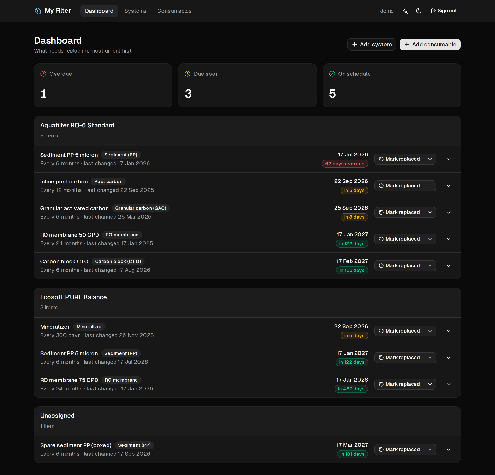
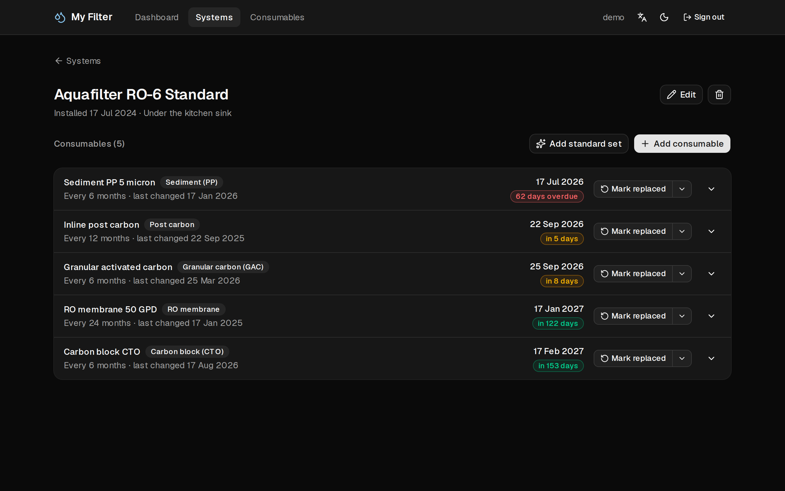
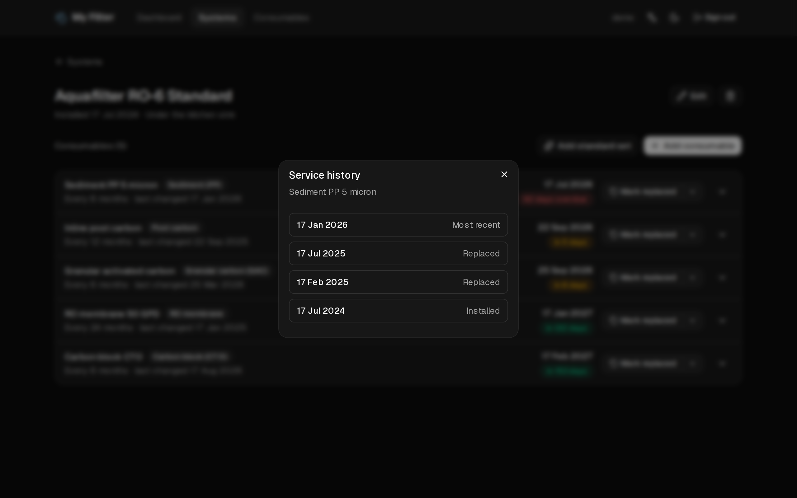

# My Filter

**English** · [Українська](README.uk.md)

Track the consumable cartridges in your home water filter (reverse osmosis) systems, and
see at a glance what is overdue for replacement.

Filters have staggered service intervals — sediment every 6 months, the membrane every
24, the post-carbon every 12 — and nobody remembers them. So the two things this app
optimises for are **seeing what is overdue** and **marking something replaced in one
click**.

## Screenshots

The dashboard, most urgent first:



A system and its cartridges, and one cartridge's service history:





Taken from the demo account `pnpm db:seed` creates.

## Stack

TypeScript · Next.js 16 (App Router) + React 19 with the React Compiler · tRPC 11 +
TanStack Query · Drizzle ORM over libSQL/SQLite · better-auth · Zod · @t3-oss/env-nextjs ·
date-fns · next-intl · next-themes · Tailwind 4 + shadcn/ui · lucide-react · sonner ·
nodemailer · Biome · Vitest · Playwright

## Getting started

```bash
pnpm install
cp .env.example .env      # then fill in BETTER_AUTH_SECRET
pnpm db:migrate
pnpm db:seed              # optional: demo account with data in mixed states
pnpm dev
```

Generate a secret with `openssl rand -base64 32`.

The seed creates `demo@myfilter.app` / `demo-password` with two systems and nine
consumables — some overdue, some due soon, one unassigned. Re-running it deletes and
recreates that user, which also signs out any open session for it. The daily digest
never emails this account, so it is safe to seed in production for demonstrations.

## Scripts

| Command | What it does |
| --- | --- |
| `pnpm dev` | Dev server on http://localhost:3000 |
| `pnpm build` / `pnpm start` | Production build (`biome ci` first, so lint errors fail it) / serve |
| `pnpm typecheck` | `next typegen && tsc --noEmit` |
| `pnpm lint` / `pnpm lint:fix` | Biome check (and autofix) |
| `pnpm format` | Biome formatter only |
| `pnpm test` / `pnpm test:watch` | Vitest — unit, router/database integration and component tests |
| `pnpm test:coverage` | The same, with a coverage report and thresholds |
| `pnpm test:e2e` / `pnpm test:e2e:ui` | Playwright against a production build (headless / UI mode) |
| `pnpm test:e2e:db` | Rebuild the throwaway e2e database in `./.e2e/` (Playwright does this itself) |
| `pnpm test:all` | Both suites |
| `pnpm db:generate` | Create a migration from schema changes |
| `pnpm db:migrate` | Apply migrations |
| `pnpm db:studio` | Drizzle Studio |
| `pnpm db:seed` | Reset and seed the demo account |
| `pnpm db:backfill-locales` | Give every existing account a language, once |
| `pnpm db:backup` | Write a restorable SQL dump into `./data/` |
| `pnpm db:delete-user` | Delete one account and all of its data |
| `pnpm check-updates` | List dependency upgrades (npm-check-updates) |

The app icons (`src/app/icon.svg`, `favicon.ico`, `apple-icon.png`) are committed files drawn
from the header's Droplets mark. After changing the mark or `--brand`, regenerate them with
`pnpm exec tsx scripts/generate-icons.ts` and commit the result.

## How it is put together

**Data model.** A *system* is a filter unit (manufacturer, model, installation date). A
*consumable* is a physical cartridge with its own service interval, owned by the user and
optionally attached to one system — detaching leaves it on an "Unassigned" shelf rather
than deleting it. Deleting a system detaches its consumables instead of destroying them.

Every replacement is appended to `consumable_replacements`, and `consumables.lastChangedOn`
is a denormalization of the newest entry maintained in the same transaction. That is what
makes the **Undo** on the replacement toast possible, and what a service-history view is
built on.

**Privacy.** Systems and consumables are private per user and will never be shareable, so
ownership is enforced on every single query rather than modelled as permissions. Another
user's row is indistinguishable from one that does not exist (`NOT_FOUND`, not
`FORBIDDEN`). `src/server/trpc/routers/ownership.test.ts` holds that line, and
`auth-gate.test.ts` walks the router so every *new* procedure is checked the day it lands.

**Tests.** The suite is built to be run after a dependency upgrade, so it leans on real
seams rather than mocks. Router tests run against an in-memory SQLite built from the actual
migrations; component tests use tRPC's `unstable_localLink`, so a click in a rendered
component travels through react-query, the real router, Zod and Drizzle into that database
— nothing stubs `fetch`. Playwright covers what Vitest structurally cannot: async Server
Components, the auth redirects, the locale Server Action, Radix overlays, the digest endpoint,
invite-only sign-up, and a Pixel 7 project that fails if any page scrolls sideways on a phone.
See the **Tests** section of `AGENTS.md` for the conventions.

CI (`.github/workflows/ci.yml`) runs lint, typecheck, coverage, build and the e2e suite on
every push and pull request, and again weekly against a fresh install, so an upstream change
shows up before anyone starts an upgrade.

**Dates.** Calendar dates are stored as `TEXT 'YYYY-MM-DD'`; instants as epoch
milliseconds (seconds on better-auth's own tables, by its convention). "Today" is determined
in the browser, not on the server, so a due date is never a day off because of the server's
timezone. The daily digest is the one exception — it has no viewer — and is described below. The arithmetic lives in
`src/lib/due-date.ts` and is unit-tested, including month-end clamping (31 Jan + 1 month
= 28 Feb) and DST boundaries.

## Deploying

`DATABASE_URL` is the only thing that changes between environments:

| Environment | `DATABASE_URL` |
| --- | --- |
| Local | `file:./data/my-filter.db` |
| Tests | `:memory:` |
| Production | `libsql://<db>.turso.io` + `DATABASE_AUTH_TOKEN` |

A file-backed SQLite cannot be the production store on serverless hosts (the filesystem is
ephemeral), which is why the app talks to libSQL from the start. To deploy on Vercel:
create a Turso database and set `DATABASE_URL`, `DATABASE_AUTH_TOKEN`, `BETTER_AUTH_SECRET`
and `BETTER_AUTH_URL`, plus `CRON_SECRET` and the mail variables below, and optionally
`INVITE_ONLY`. Migrations need no manual step: the `vercel-build` script runs
`pnpm db:migrate` against the remote database after a successful build.

Production deploys come from CI, not from Vercel's Git integration: `vercel.json` turns
automatic deploys off, and the `deploy` job in `.github/workflows/ci.yml` runs
`vercel deploy --prod` only after a push to `main` has passed `verify`. Since `vercel-build`
migrates, that also keeps an untested migration away from the production database. It needs
a GitHub environment named `production` holding the secret `VERCEL_TOKEN` and the variables
`VERCEL_ORG_ID` and `VERCEL_PROJECT_ID` (both in `.vercel/project.json` after `vercel link`).

### Email digest

Once a day (`vercel.json`, `0 9 * * *` UTC) Vercel calls `/api/cron/digest`, which emails
each user about their cartridges: a warning when one is due within fourteen days, and a
notice once it is due or overdue — combined into a single message when both apply, in the
user's own language. Which day counts as "today" is resolved in `Europe/Kyiv`, so the
schedule shifting an hour across DST never changes what is reported.

Each notice is claimed in `notification_log` before it is sent and released if sending fails,
so a failed run delays a reminder by a day rather than losing or duplicating it.

| Variable | |
| --- | --- |
| `CRON_SECRET` | Vercel sends it as a bearer token. Unset, the endpoint refuses every request. |
| `MAIL_TRANSPORT` | `log` (default) writes the email to the server log; `gmail` sends it. |
| `GMAIL_USER` / `GMAIL_APP_PASSWORD` | For `gmail`. An [App Password](https://myaccount.google.com/apppasswords), which needs 2-Step Verification. |
| `MAIL_FROM` | Optional; defaults to `GMAIL_USER`. |

Because `log` is the default, local development, CI and a fresh clone need no mail secrets.

### Invite-only registration

`INVITE_ONLY=true` closes open registration. `/register` then only works through an invite
link, and every signed-in user gets an **Invites** page to create them: each link works for
one person, expires after 14 days, and a user can hold at most five open ones at a time. The
shared demo account cannot create any. Unset or `false`, registration is open and nothing
about invites is visible.

Switch it on once at least one real account exists. Nobody can register without a link, so a
fresh deploy with the switch already on has nobody to send the first one.

### Backups

`pnpm db:backup` dumps whatever `DATABASE_URL` points at, so taking a copy of production is
a matter of running it locally with production credentials:

```bash
DATABASE_URL="libsql://<db>.turso.io" DATABASE_AUTH_TOKEN="<token>" pnpm db:backup
```

It writes `data/<database>-<date>.sql` — a second run the same day lands beside the first
rather than over it — and prints a row count per table. `/data` is gitignored, which matters:
the dump contains better-auth password hashes and live session tokens.

It is a plain SQL script because nothing else is portable here. Turso has no binary export
over the client library, and depending on the `turso` CLI or a `sqlite3` binary would mean a
backup you cannot take from a fresh clone. Restoring does want one of those, though:

```bash
turso db shell <database> < data/my-filter-2026-09-15.sql   # or
sqlite3 restored.db < data/my-filter-2026-09-15.sql
```

The dump disables foreign keys before `BEGIN` — the tables come out in `sqlite_master` order,
which knows nothing about which references which — and keeps the `__drizzle_migrations` table,
so a restored copy does not try to re-apply every migration.

### Deleting an account

`pnpm db:delete-user <id or email>` prints what it would remove and stops. `--confirm` makes
it real; against a remote `DATABASE_URL` it *also* asks for the account's email to be typed
back, and refuses outright with no terminal to ask in unless `--yes` says that is deliberate.
`NODE_ENV` is no help there — a script run from a laptop against Turso is "development" by
every measure Node has — so a non-`file:` URL is what stands in for production.

## Language and theme

English and Ukrainian, chosen from the header and remembered in a cookie. There is no
`/uk/` URL prefix and no middleware: `src/i18n/request.ts` resolves the cookie, falling
back to `Accept-Language` and then English, so a first-time Ukrainian visitor lands in
Ukrainian without a redirect.

Getting Ukrainian right is mostly about **plurals**. It has four categories where English
has two, and the `one` category includes 21 and 101 — so "in 1 day / in 3 days" is
*через 1 день / через 3 дні / через 5 днів / через 21 день*. Every count therefore goes
through an ICU message rather than a `=== 1` check, and `src/i18n/messages.test.ts` asserts
the forms at 1, 3, 5, 11, 21 and 22. The same test fails the build if the two catalogues
drift apart or an ICU message stops compiling.

Translating never touches stored data. Enum-like values were already stable keys, and the
two places that *did* write English into the database have been fixed: applying a preset
now creates cartridges named in the user's own language (ordinary, editable user data from
then on), and the replacement log stores no label at all — whether an entry is the
installation, the most recent, or a plain replacement follows from its position.

The UI is **dark by default**, with a Light/Dark/System toggle beside the language picker.
The theme is kept in `localStorage` and applied by a pre-paint script, so there is no
flash and no cost to prerendering.
