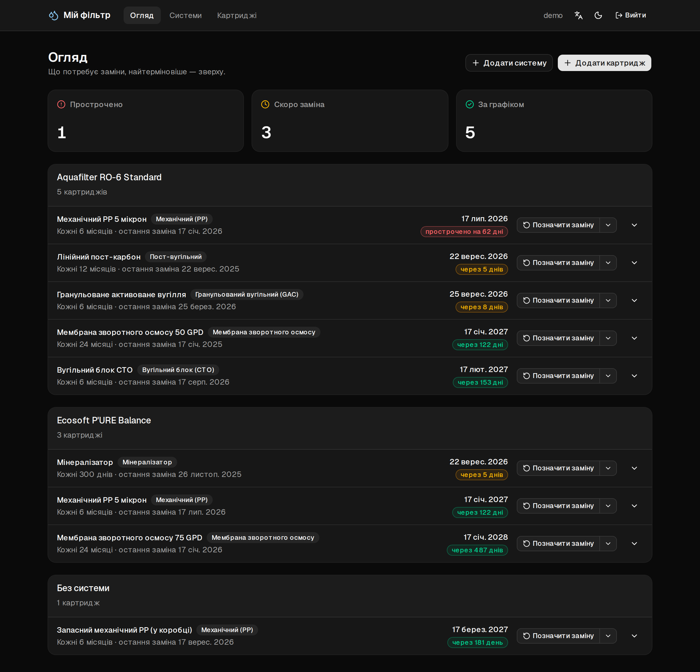
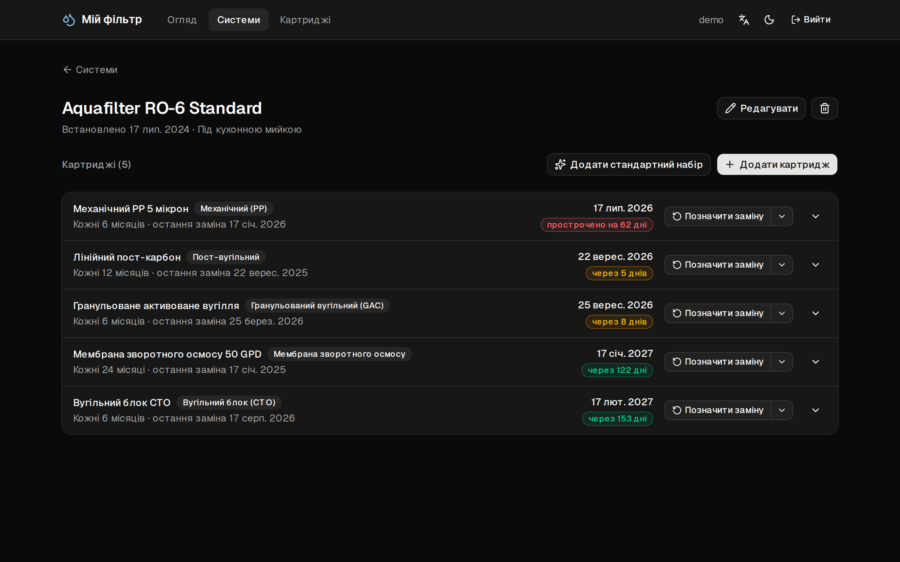
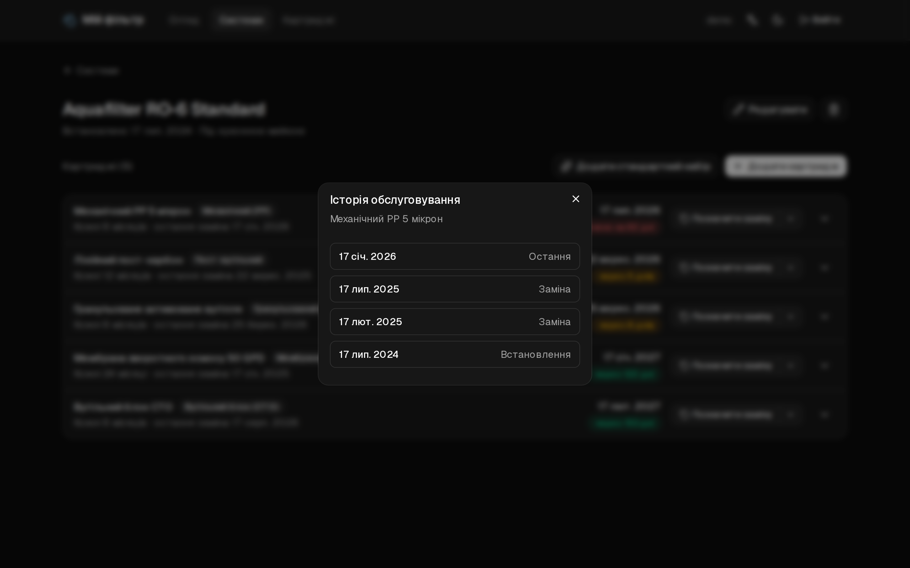

# Мій фільтр

[English](README.md) · **Українська**

Застосунок для обліку змінних картриджів у побутових системах фільтрації води (зворотного
осмосу): одразу видно, які з них уже час замінити.

Картриджі мають різні терміни служби — механічний міняють раз на 6 місяців, мембрану раз на
24, пост-вугільний раз на 12, — і запам'ятати все це неможливо. Тому застосунок зосереджений
на двох речах: **показати, що прострочено**, і **дати змогу позначити заміну одним кліком**.

## Знімки екрана

Огляд, найтерміновіше — зверху:



Система з її картриджами та історія обслуговування одного з них:





Знімки зроблено на демо-акаунті, який створює `pnpm db:seed`; назви картриджів для них
перекладено українською, а сам скрипт створює англійські.

## Технології

TypeScript · Next.js 16 (App Router) + React 19 з React Compiler · tRPC 11 +
TanStack Query · Drizzle ORM поверх libSQL/SQLite · better-auth · Zod · @t3-oss/env-nextjs ·
date-fns · next-intl · next-themes · Tailwind 4 + shadcn/ui · lucide-react · sonner ·
nodemailer · Biome · Vitest · Playwright

## Як запустити

```bash
pnpm install
cp .env.example .env      # потім заповніть BETTER_AUTH_SECRET
pnpm db:migrate
pnpm db:seed              # необов'язково: демо-акаунт із даними в різних станах
pnpm dev
```

Секрет можна згенерувати командою `openssl rand -base64 32`.

`pnpm db:seed` створює акаунт `demo@myfilter.app` / `demo-password` із двома системами та
дев'ятьма картриджами: одні вже прострочені, іншим скоро настане час заміни, а один не
прив'язаний до жодної системи. Під час повторного запуску користувача буде видалено й
створено заново, тож усі його відкриті сесії завершаться. Щоденний дайджест цьому акаунту
листів не надсилає, тому його можна спокійно створити й у продакшені — для демонстрацій.

## Скрипти

| Команда | Що робить |
| --- | --- |
| `pnpm dev` | Сервер розробки на http://localhost:3000 |
| `pnpm build` / `pnpm start` | Продакшн-збірка (спершу запускається `biome ci`, тож помилки лінтера зупиняють збірку) / запуск |
| `pnpm typecheck` | `next typegen && tsc --noEmit` |
| `pnpm lint` / `pnpm lint:fix` | Перевірка Biome (з автовиправленням) |
| `pnpm format` | Лише форматування Biome |
| `pnpm test` / `pnpm test:watch` | Vitest — модульні тести, інтеграційні тести роутерів і бази даних, тести компонентів |
| `pnpm test:coverage` | Те саме зі звітом про покриття та мінімальними порогами |
| `pnpm test:e2e` / `pnpm test:e2e:ui` | Playwright на продакшн-збірці (без інтерфейсу / в UI-режимі) |
| `pnpm test:e2e:db` | Перестворити тимчасову базу для e2e у `./.e2e/` (Playwright робить це автоматично) |
| `pnpm test:all` | Усі тести разом |
| `pnpm db:generate` | Створити міграцію на основі змін у схемі |
| `pnpm db:migrate` | Застосувати міграції |
| `pnpm db:studio` | Drizzle Studio |
| `pnpm db:seed` | Перестворити демо-акаунт із даними |
| `pnpm db:backup` | Зберегти SQL-дамп для відновлення в `./data/` |
| `pnpm db:delete-user` | Видалити акаунт разом з усіма його даними |
| `pnpm check-updates` | Показати доступні оновлення залежностей (npm-check-updates) |

Іконки застосунку (`src/app/icon.svg`, `favicon.ico`, `apple-icon.png`) зберігаються в
репозиторії й згенеровані з логотипа-краплі в шапці. Якщо змінюєте логотип або `--brand`,
перегенеруйте їх командою `pnpm exec tsx scripts/generate-icons.ts` і закомітьте результат.

## Як усе влаштовано

**Модель даних.** *Система* — це фільтр як пристрій: виробник, модель, дата встановлення.
*Картридж* — конкретний змінний елемент із власним інтервалом заміни. Він належить
користувачеві й може бути прив'язаний до однієї системи; якщо його від'єднати, він не
зникає, а переходить до розділу «Без системи». Так само й видалення системи лише від'єднує
її картриджі, а не видаляє їх.

Кожна заміна записується до `consumable_replacements`, а поле `consumables.lastChangedOn`
дублює дату останнього запису й оновлюється в тій самій транзакції. Завдяки цьому працює
кнопка **Скасувати** у сповіщенні про заміну, і на цьому ж побудована історія обслуговування.

**Приватність.** Системи й картриджі бачить лише їхній власник, і ділитися ними не можна
буде ніколи. Тому доступ не описується через дозволи, а перевіряється в кожному запиті.
Чужий запис для користувача виглядає так само, як неіснуючий (`NOT_FOUND`, а не
`FORBIDDEN`). За цим стежить `src/server/trpc/routers/ownership.test.ts`, а
`auth-gate.test.ts` перебирає всі процедури роутера, тож кожна *нова* процедура одразу
потрапляє під перевірку.

**Тести.** Тести написано так, щоб їм можна було довіряти після оновлення залежностей,
тому вони перевіряють реальну взаємодію бібліотек, а не моки. Тести роутерів працюють із
SQLite у пам'яті, створеною зі справжніх міграцій. Тести компонентів використовують
`unstable_localLink` із tRPC, тож клік у компоненті проходить через react-query, справжній
роутер, Zod і Drizzle аж до бази даних — `fetch` ніде не підмінюється. Playwright покриває
те, що Vitest перевірити в принципі не може: асинхронні Server Components, редиректи
авторизації, Server Action для зміни мови, оверлеї Radix, ендпоінт дайджесту, реєстрацію
за запрошенням, а також окремий проєкт для Pixel 7, який не проходить, якщо хоч одна
сторінка на телефоні прокручується по горизонталі. Домовленості щодо тестів описано в
розділі **Tests** файлу `AGENTS.md` (англійською).

CI (`.github/workflows/ci.yml`) запускає лінтер, перевірку типів, тести з покриттям, збірку
та e2e-тести на кожен push і pull request, а також щотижня на чистому встановленні
залежностей — щоб зміни в бібліотеках стали помітні ще до того, як хтось почне оновлення.

**Дати.** Календарні дати зберігаються як `TEXT 'YYYY-MM-DD'`, а мітки часу — у мілісекундах
(у власних таблицях better-auth — у секундах, як заведено в цій бібліотеці). «Сьогодні»
визначає браузер, а не сервер, тож через часовий пояс сервера дата заміни ніколи не
зсунеться на день. Єдиний виняток — щоденний дайджест, адже його ніхто не відкриває в
браузері; про нього нижче. Усі обчислення зібрано в `src/lib/due-date.ts` і покрито
тестами, зокрема для кінця місяця (31 січня + 1 місяць = 28 лютого) і переходу на
літній/зимовий час.

## Розгортання

Між середовищами змінюється лише `DATABASE_URL`:

| Середовище | `DATABASE_URL` |
| --- | --- |
| Локально | `file:./data/my-filter.db` |
| Тести | `:memory:` |
| Продакшн | `libsql://<db>.turso.io` + `DATABASE_AUTH_TOKEN` |

На serverless-хостингах файлова система тимчасова, тож SQLite у файлі не підходить для
продакшену — саме тому застосунок від початку працює через libSQL. Щоб розгорнути його на
Vercel, створіть базу даних у Turso й задайте змінні `DATABASE_URL`, `DATABASE_AUTH_TOKEN`,
`BETTER_AUTH_SECRET`, `BETTER_AUTH_URL`, `CRON_SECRET`, поштові змінні (див. нижче) і, за
потреби, `INVITE_ONLY`. Міграції вручну запускати не треба: після успішної збірки скрипт
`vercel-build` сам виконує `pnpm db:migrate` для віддаленої бази.

Продакшн розгортає CI, а не Git-інтеграція Vercel: `vercel.json` вимикає автоматичні
розгортання, а job `deploy` у `.github/workflows/ci.yml` запускає `vercel deploy --prod`
лише після того, як пуш у `main` пройшов `verify`. Оскільки `vercel-build` виконує міграції,
це також не пускає неперевірену міграцію до продакшн-бази. Потрібне GitHub-середовище
`production` із секретом `VERCEL_TOKEN` і змінними `VERCEL_ORG_ID` та `VERCEL_PROJECT_ID`
(обидва є в `.vercel/project.json` після `vercel link`).

### Поштовий дайджест

Щодня (`vercel.json`, `0 9 * * *` UTC) Vercel викликає `/api/cron/digest`, і кожен
користувач отримує лист про свої картриджі: попередження, коли до заміни лишається
чотирнадцять днів або менше, і нагадування, коли термін настав чи минув. Якщо актуальні
обидва, вони приходять одним листом — мовою користувача. «Сьогодні» для дайджесту
визначається за часовим поясом `Europe/Kyiv`, тож коли під час переходу на літній чи зимовий
час розклад зсувається на годину, зміст листів від цього не змінюється.

Перед надсиланням кожне повідомлення резервується в `notification_log`, а якщо надіслати не
вдалося, резерв знімається. Тож збій лише відкладає нагадування на день — воно не загубиться
й не прийде двічі.

| Змінна | |
| --- | --- |
| `CRON_SECRET` | Vercel передає її як bearer-токен. Якщо її не задано, ендпоінт відхиляє всі запити. |
| `MAIL_TRANSPORT` | `log` (типово) — лист записується в лог сервера; `gmail` — лист надсилається. |
| `GMAIL_USER` / `GMAIL_APP_PASSWORD` | Для `gmail`. Потрібен [пароль застосунку](https://myaccount.google.com/apppasswords), а для нього — двоетапна перевірка. |
| `MAIL_FROM` | Необов'язково; типово збігається з `GMAIL_USER`. |

Оскільки типово використовується `log`, для локальної розробки, CI чи щойно клонованого
репозиторію жодні поштові секрети не потрібні.

### Реєстрація лише за запрошенням

`INVITE_ONLY=true` закриває вільну реєстрацію. Тоді `/register` відкривається лише за
посиланням-запрошенням, а кожен авторизований користувач отримує сторінку **Запрошення**,
де може їх створювати. Одне посилання — для однієї людини, діє 14 днів, і одночасно
користувач може мати щонайбільше п'ять активних запрошень. Спільний демо-акаунт створювати
запрошення не може. Якщо змінну не задано або вона дорівнює `false`, реєстрація відкрита, а
все, що стосується запрошень, приховано.

Вмикайте цей режим лише тоді, коли вже є хоча б один справжній акаунт. Без запрошення
зареєструватися неможливо, тож якщо ввімкнути його на новому розгортанні одразу, першого
запрошення просто нікому буде створити.

### Резервне копіювання

`pnpm db:backup` робить дамп тієї бази, на яку вказує `DATABASE_URL`, тож для копії
продакшн-бази достатньо запустити команду локально з продакшн-доступами:

```bash
DATABASE_URL="libsql://<db>.turso.io" DATABASE_AUTH_TOKEN="<token>" pnpm db:backup
```

Дамп зберігається у файл `data/<database>-<date>.sql` (повторний запуск того ж дня створить
новий файл, а не перезапише попередній), а в консоль виводиться кількість рядків у кожній
таблиці. Тека `/data` додана до `.gitignore`, і це важливо: дамп містить хеші паролів
better-auth і чинні токени сесій.

Формат — звичайний SQL-скрипт, бо лише він тут працює скрізь. Turso не дає бінарного
експорту через клієнтську бібліотеку, а залежність від CLI `turso` чи `sqlite3` означала б,
що зі щойно клонованого репозиторію резервну копію не зробити. Для відновлення ж один із цих
інструментів таки знадобиться:

```bash
turso db shell <database> < data/my-filter-2026-09-15.sql   # або
sqlite3 restored.db < data/my-filter-2026-09-15.sql
```

Дамп вимикає перевірку зовнішніх ключів ще до `BEGIN`, бо таблиці в ньому йдуть у порядку
`sqlite_master`, який не враховує зв'язків між ними. Таблиця `__drizzle_migrations` також
зберігається, тож відновлена база не намагатиметься застосувати всі міграції заново.

### Видалення акаунта

`pnpm db:delete-user <id або email>` лише показує, що буде видалено, і нічого не змінює.
Щоб справді видалити, додайте `--confirm`. Якщо `DATABASE_URL` вказує на віддалену базу,
команда *додатково* попросить ввести email акаунта, а якщо запитати нема де (немає
терміналу), відмовиться працювати — хіба що прапорець `--yes` підтвердить, що так і задумано.
На `NODE_ENV` покладатися тут не можна: скрипт, запущений з ноутбука на базі в Turso, для
Node завжди «development». Тому ознакою продакшену вважається `DATABASE_URL`, що не
починається з `file:`.

## Мова й тема

Інтерфейс доступний англійською та українською. Мову можна змінити в шапці, а вибір
зберігається в cookie. Префікса `/uk/` в URL немає, як і middleware: `src/i18n/request.ts`
бере мову з cookie, якщо її там немає — з `Accept-Language`, а якщо й там немає — вмикає
англійську. Тож відвідувач з українським браузером одразу бачить українську версію, без
жодних редиректів.

Найскладніше в українській локалізації — **множинні форми**. В англійській їх дві, в
українській — чотири, до того ж категорія `one` охоплює й 21, і 101: *через 1 день / через
3 дні / через 5 днів / через 21 день*. Тому всі числа виводяться через ICU-повідомлення, а
не через перевірку `=== 1`, а `src/i18n/messages.test.ts` перевіряє форми для 1, 3, 5, 11, 21
і 22. Цей самий тест не пропустить збірку, якщо між двома каталогами перекладів з'явиться
розбіжність або якесь ICU-повідомлення перестане компілюватися.

Переклад не зачіпає збережених даних. Значення-переліки й раніше зберігалися як незмінні
ключі, а два місця, де в базу потрапляв англійський текст, виправлено. Тепер готовий набір
картриджів створює їх із назвами мовою користувача (далі це звичайні дані, які можна
редагувати), а журнал замін узагалі не зберігає підписів: чи запис є встановленням,
останньою заміною чи звичайною заміною, визначається його місцем у списку.

Типово інтерфейс **темний**, а поруч із вибором мови є перемикач Світла/Темна/Системна.
Тема зберігається в `localStorage` і застосовується ще до відображення сторінки, тож екран
не блимає, а пререндеринг не страждає.
